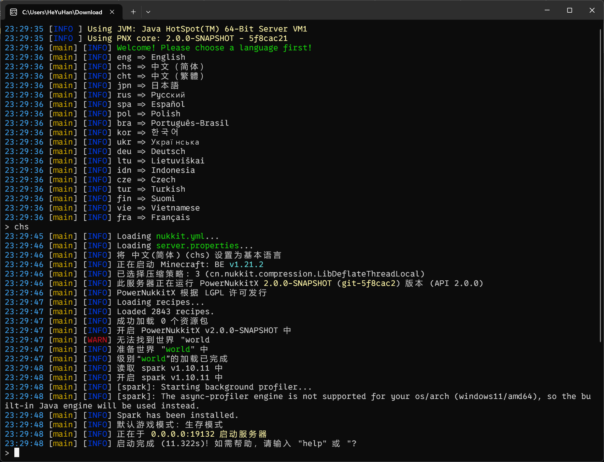
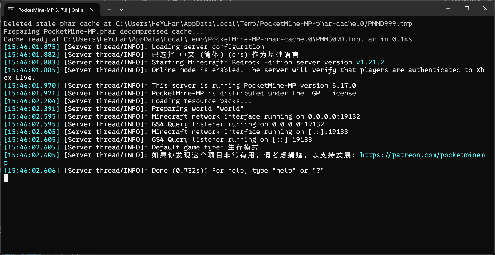

:::tip
本篇文档已完成编写！ 
支持后续 PR

# Biggest SUCCESS

作者：[梦涵LOVE](https://github.com/MengHanLOVE1027)
:::

# 服务器核心选择

import Tabs from '@theme/Tabs';
import TabItem from '@theme/TabItem';

<Tabs queryString="server-core-choose">
<TabItem value="bds" label="Bedrock Dedicated Server(BDS)">

:::warning
至本篇文档开始，**`BDS`** 一致指 **`Bedrock Dedicated Server`**，而不是指 **`Beidou Navigation Satellite System`**(北斗卫星导航系统)
:::

此服务器核心允许 _Minecraft 腐竹_ 在家里使用安装有 **Windows** 或 **Linux** 的设备或使用 **云服务托管**(云服务器)来搭建属于自己的 BDS 服务器。
这是坐落于 **Minecraft 官网** 的服务端(与 Java 的 Vanilla 服务端在一个页面)。作为官方服务端，它有着极其完善的 Minecraft 特性和流畅的游戏体验，几乎和单人一模一样，说是生存服首当之选也不为过。

**优势**：

- 官方支持：作为 Mojang 官方推出的服务器端软件，BDS 能够获得官方的最新更新和支持，确保与 Minecraft 基岩版的最新版本兼容。
- 文档和社区支持：虽然官方提供了一些基本文档，但不如第三方服务器端软件的社区那样提供丰富的教程和支持。社区插件内容庞大，基本满足腐竹的日常需求(虽然官方服务端无法加载插件，但可以通过
[社区开发的加载器](/docs-bedrock/bds-core/process/plugins/plugins-loader-choose.md#bds - 社区开发的加载器)
解决这一问题)。

- 稳定性：由于是官方产品，BDS 在稳定性方面通常表现良好，能够提供可靠的服务器体验。
- 兼容性：BDS 与 **Minecraft 基岩版客户端** 的兼容性最好，确保玩家可以无缝连接和游戏。
- 安全性：官方服务器端软件通常会得到更频繁的安全更新，减少了潜在的安全风险。
- 资源利用：BDS 针对 **Minecraft 基岩版** 进行了优化，能够高效利用服务器资源。

**劣势**：

- 定制性有限：与一些第三方服务器端软件相比，BDS 的定制性和扩展性可能 **较为有限**，**不支持插件系统**，限制了服务器的个性化。
- 性能优化：虽然 BDS 性能稳定，但可能在某些方面(如多核优化)不如专门的第三方服务器端软件。它的生物运算运行在一个线程上。意味着你的服务器的流畅度主要取决于 **CPU 的单核性能**。
这使得地图越大，服务器就越 [卡顿](https://yizhan.wiki/NitWikit/start/basic/what-is-caton)，不如 Java 版服务端流畅，因为 Java 版服务端 **支持多核运行**。
- 高级功能缺失：BDS 可能不支持一些高级功能，如自定义世界生成、高级权限管理等，这些通常需要第三方软件才能实现。
- 内存泄漏：内存占用会 _缓慢_ 增加，有时严重的还会导致 **内存泄漏**。如果强行进行 **内存清理** 的话，会导致玩家在进入 **装有 材质包 / Addon 的服务器** 时 **该玩家客户端无法下载对应内容**，致使下载进度条卡条，只能让腐竹重启服务器解决。

总体来说，Bedrock Dedicated Server 适合那些希望获得官方支持、稳定性和兼容性的服务器管理员。如果你的服务器不需要复杂的定制或高级功能，BDS 是一个可靠的选择。然而，对于那些需要更多自定义选项和高级功能的用户，可能需要考虑使用第三方服务器端软件。

</TabItem>
<TabItem value="nukkit" label="Nukkit(NK)">

:::warning
至本篇文档开始，**`NK`** 一致指 **`Nukkit`**，但考虑到全称不长，因此二者都会出现在本文档中
:::

它的名字，很像 Java 版服务端的 Bukkit。没错，它就是 _意图_ 创作出来类似 Bukkit 的基岩版服务端，编写语言正是 **Java**。

**优势**：

- 轻量级：Nukkit 设计轻量，对系统资源的 **需求相对较低**，适合在 **资源有限** 的服务器上运行。
- 高性能：Nukkit 在性能方面进行了优化，能够 **支持较多的同时在线玩家**，保持良好的游戏体验。
- 插件系统：Nukkit 拥有一个 **活跃的插件生态系统**，用户可以轻松地安装和使用各种插件来扩展服务器功能。
- 跨平台：Nukkit **支持多个操作系统**，包括 Windows、Linux 和 macOS，方便在不同平台上搭建服务器。
- 易于上手：相对于其他服务器端软件，Nukkit 的配置和使用较为简单，适合初学者 **快速搭建服务器**。
- 社区支持：Nukkit 有一个相对活跃的社区，用户可以从中获得帮助和资源。

**劣势**：

- 更新滞后：Nukkit 的更新可能不如官方服务器端软件那样及时，可能无法立即支持最新的 Minecraft 版本和特性。
- 生态系统限制：虽然 Nukkit 的插件生态系统活跃，但与一些更流行的服务器端软件(如 Spigot/Paper)相比，可用的插件和资源可能较少。
- 多核优化不足：早期的 Nukkit 版本在多核处理器优化方面可能不如其他服务器端软件，这可能会 **限制其在高性能服务器上的性能表现**。
- 文档和教程：虽然社区活跃，但 **高质量的官方文档和教程可能相对缺乏**，新用户可能需要花费更多时间学习和解决问题。
- 稳定性问题：由于开源项目的性质，Nukkit 可能偶尔会出现稳定性问题，尤其是在处理大量玩家或复杂插件时。

总的来说，Nukkit 是一个适合初学者和小型服务器使用的轻量级 Minecraft 服务器端软件，它提供了足够的性能和可扩展性来满足基本需求。然而，对于需要最新游戏特性、高级优化和广泛插件支持的大型服务器，可能需要考虑其他选项。

</TabItem>
<TabItem value="pnx" label="PowerNukkitX(PNX)">

:::danger [此核心短时间内不再可用]

# RIP 

:::

:::warning
至本篇文档开始，**`PNX`** 一致指 **`PowerNukkitX`**
:::

**优势**：

- 最新版 mcbe(基岩版) 协议支持：PNX 支持最新的 Minecraft 基岩版协议，这意味着它 **可以兼容最新的游戏版本和特性**。
- 丰富的原版特性支持：支持 1.19 版本的所有新方块和新物品，以及新版下界等特性。
- 高性能和高拓展性：PNX 进行了多核优化，提供了更高的性能和更好的扩展性。
- 384 格世界支持：允许在主世界达到 384 格的高度限制。
- 史诗地形生成器：内置 Terra 地形生成器，支持创建丰富的地图环境。
- 全开源和全 API 开放：PNX 完全开源，提供了丰富的 API，方便开发者进行定制和扩展。
- 插件兼容性：兼容 Nukkit 生态中的数千个插件，同时支持使用 Java， Kotlin， Scala， Python， JavaScript， Lua 等 JVM 语言编写插件。

**劣势**：

- 开发活跃度：由于 Nukkit 核心开发团队的变化，PNX 的开发强度可能受到影响。
- 生态系统的局限性：虽然 PNX 拥有丰富的插件，但与一些更主流的服务器端软件相比，其生态系统可能相对较小。
- 学习曲线：由于 PNX 生态的广阔和插件的多样性，对于新手来说，学习如何有效地使用和管理 PNX 服务器可能会有一定的难度。

总体来看，PowerNukkitX 是一个功能强大且高度可定制化的 Minecraft 基岩版服务器端软件，特别适合那些需要高性能和高度自定义服务器的用户。然而，它的使用和维护可能需要一定的技术知识和耐心。

</TabItem>
<TabItem value="pmmp" label="PocketMine-MP(PMMP)">

:::warning
至本篇文档开始，**`PMMP`** 一致指 **`PocketMine-MP`**
:::

**优势**：

- 插件生态丰富：PocketMine-MP 拥有一个 **庞大的插件生态系统**，用户可以找到各种插件来增强服务器的功能和玩家体验。
- 跨平台兼容性：PocketMine-MP **支持多个操作系统**，包括 Windows、Linux 和 macOS，便于在不同环境下部署。
- PHP 编程语言：使用 PHP 编写插件，对于熟悉 PHP 的开发者来说，入门门槛相对较低。
- 社区支持：PocketMine-MP 有一个活跃的社区，提供插件开发、服务器配置和故障排除的帮助。
- 自定义性：服务器管理员可以自由地定制服务器，包括游戏规则、世界生成和玩家互动等。

**劣势**：

- 性能问题：PocketMine-MP 在处理高玩家负载时 **可能存在性能瓶颈**，尤其是在内存管理和 CPU 效率方面。
- 更新滞后：PocketMine-MP 可能不会立即跟进 **Minecraft 基岩版** 的最新更新，导致玩家无法体验最新的游戏内容。
- 稳定性：由于插件系统的开放性，服务器在运行多个插件时 **可能会遇到稳定性问题**。
- 资源消耗：PHP 作为解释型语言，相比编译型语言 **可能在资源消耗上更为显著**。
- 学习曲线：对于新手管理员来说，PocketMine-MP 的 **配置和插件管理可能需要一定的学习时间**。

PocketMine-MP 适合那些重视插件功能和自定义能力的服务器管理员。如果你希望建立一个具有特色玩法和丰富互动的服务器，并且不介意在性能和稳定性方面做出一些妥协，PocketMine-MP 是一个不错的选择。然而，如果你更关注性能和最新游戏内容的支持，可能需要考虑其他服务器端解决方案。

</TabItem>
</Tabs>
