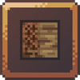

# 资源包框架

import Tabs from '@theme/Tabs';
import TabItem from '@theme/TabItem';

<Tabs queryString="ff">
<TabItem value="ia" label="ItemsAdder">

:::info

`SpigotMC` https://www.spigotmc.org/resources/.73355/

`GitHub(主页)` https://github.com/ItemsAdder

`GitHub(可以反馈BUG)` https://github.com/PluginBugs/Issues-ItemsAdder

`文档(英文)` https://itemsadder.devs.beer/

`文档(中文)` https://itemsadder.devs.beer/v/chinese

`文档(非官方中文)` https://docs.superiormc.cn/v/itemsadder-doc

:::

# ItemsAdder


ItemsAdder 是一款老牌的 Minecraft 资源包插件，插件付费闭源，
专注于为游戏提供物品、生物、盔甲、HUD、GUI、表情、液体等自定义功能。
它通过插件与资源包的结合，实现了对 Minecraft 游戏内容的深度拓展，
允许服务器管理员和玩家自定义游戏内的物品和机制。

:::warning
GitHub上并没有上传插件本体
:::

## 优点

- 老牌插件：ItemsAdder 是最早一批支持通过插件+资源包实现物品拓展的工具之一，拥有成熟的生态系统和广泛的用户基础。
- 功能丰富：支持自定义物品、生物、盔甲、表情、液体等多种内容，几乎可以满足所有服主的创意需求。
- 社区支持：由于用户众多，社区中提供了大量现成的资源包和配置示例，方便服主快速上手。

## 缺点

- 维护不积极：插件的开发者维护较为缓慢，可能会导致一些兼容性问题或漏洞未及时修复。
- 对原版特性破坏较大：由于通过插件进行修改，对原版游戏的某些特性造成破坏或干扰。

## 使用建议

- 适合有基础的服主：如果你对 Minecraft 插件和资源包有一定的了解，ItemsAdder 是一个非常强大的工具，可以极大地丰富服务器的内容。
- 谨慎尝试：如果你是新手服主，建议先学习一些基础知识，或者选择更简单易用的插件。
- 备份数据：在使用 ItemsAdder 时，建议定期备份服务器数据，以防止插件问题导致数据丢失。

:::tip
所有使用资源包拓展物品的插件其学习曲线较大，服主需要有一定基础情况下进行尝试，没有基础的情况下不推荐使用这类插件！
:::

```text
【IA入门指南.新手必看.简洁版】
-
第一步：IA是基于原版的材质包框架所开发的插件，所以遵守Mojang制定的材质包规范， 如果你会材质包开发甚至不需要用到IA。如果你在使用IA时连CMD，命名空间，着色器，JSON这些最基本的内容都不知道请恶补以下内容：
https://zhangshenxing.github.io/VanillaModTutorial
-
第二步：
使用IA官方WIKI并结合原版材质包开发产出内容，但是请注意IA内有大量无用功能和屎山代码，所以将IA当作一个打包器是最优解的选择
https://itemsadder.devs.beer
-
第三步：如何让你的服务器更加劣质的办法(仅我个人而言，如果你看的很不舒服我很抱歉，如果你要对号入座那就是你是对的)
1. 大量声明空间引用乱的一批，这类服务器要不就是腐竹技术过低，要不就是海鲜缝合包或盗用，连国外9美刀的付费端都不如
2. 材质混素严重，在16px-128px漂浮不定，没有自己的主美体系
3. 乱加插件，看啥加啥，导致服务器变成性能答辩，这种服开不了几个月就跑路
4. 在高版本非特殊需求还在使用单端开发，没有采用最基本的群组框架

                                    ————来自ia群 群公告
```

</TabItem>
<TabItem value="orx" label="Oraxen">

:::info

`SpigotMC` https://www.spigotmc.org/resources/.72448

`GitHub` https://github.com/oraxen/oraxen

`文档(英文)` https://docs.oraxen.com/

`文档(中文)` https://snowcutieowo.github.io/Oraxen/README.html

`文档(另一个中文文档)` https://3504743864.gitbook.io/oraxen-wiki

:::

# Oraxen


:::danger
此插件已停更，不推荐使用！
:::

Oraxen 是一款老牌的 Minecraft 插件，专注于通过资源包和插件结合的方式实现物品、方块、表情、家具等内容的自定义扩展。
它支持从 1.18 到 1.21.4 的多个 Minecraft 版本，是另一个许多服主用来丰富服务器内容的工具之一。

## 优点

- 老牌插件：作为第一代支持插件+资源包实现物品拓展的工具之一，Oraxen 拥有成熟的生态系统和广泛的用户基础。
- 功能丰富：支持自定义物品、方块、表情、家具等多种内容，能够满足服主的创意需求。
- 付费开源：插件付费代码开源，用户可以前往 spigotmc 购买插件，或者通过开源代码自行构建。
- 灵活性高：对于有技术能力的服主，Oraxen 提供了高度的自定义能力，可以通过资源包和代码实现复杂的功能。

## 缺点

- 插件已停更：Oraxen 的开发团队已将主要精力转移到新项目 Nexo，导致插件的维护和更新停滞。
- 对原版特性破坏较大：由于通过插件进行修改，对原版游戏的某些特性造成破坏或干扰。
- 技术门槛较高：对于没有资源包制作经验或代码能力的服主，使用 Oraxen 可能会遇到较大的学习曲线。

## 使用建议

- 适合有技术能力的服主：如果你熟悉资源包制作，并且有能力通过代码补充插件的不足，Oraxen 是一个非常强大的工具。
- 谨慎选择：如果你没有资源包制作能力，或者不想花费时间学习，建议考虑其他更简单易用的插件，例如 ItemsAdder。
- 关注替代方案：由于 Oraxen 已停更，建议关注其替代项目 Nexo，或者选择其他活跃的插件。

如果你没有能力手搓出你想要的东西(如对资源包非常了解，能自己写代码补Oraxen没有的功能)那就去花钱用旁边的 ItemsAdder

</TabItem>

<TabItem value="ce" label="CraftEngine">

:::info

`GitHub` https://github.com/Xiao-MoMi/craft-engine

`文档(英文原文)` https://mo-mi.gitbook.io/xiaomomi-plugins/craftengine

`文档(中文翻译)` https://momi.gtemc.cn/craftengine

:::

:::warning
本项目处于开发状态
:::

# CraftEngine



CraftEngine 是一款专为 Minecraft 服务器设计的插件 + 服务端 mod（可选）,
旨在通过配置文件动态创建自定义方块、物品和配方，
从而实现高度灵活的自定义内容扩展。

该插件基于 Paper/Folia 服务器核心开发，支持 1.20.1 及以上版本，并通过 JVM 级注入技术提供卓越的性能、稳定性和扩展性。

## 插件特点
### 更稳定的自定义方块实现

与传统插件不同，CraftEngine通过创新注入机制实现自定义方块注册，
彻底避免破坏原版方块特性，最多存在视觉同步效果差异。

CraftEngine支持强大的自定义方块行为系统，
开发者可根据需求灵活定义方块的行为。

### 更安全的资源包保护

:::danger
不要尝试解压开启了 crash-tools 的的资源包！
:::

:::warning
这个保护并不是100%的防御，
你可能需要[《中华人民共和国著作权法》](https://www.gov.cn/guoqing/2021-10/29/content_5647633.htm) 的保护！

如果发现有可以破解资源包的工具可以向本插件的 [Discord](https://discord.gg/WVKdaUPR3S) 频道提交问题！
:::

CraftEngine 提供了比 PackSquash 更强大的内置资源包保护

推荐配置：

```yaml
protection:
  crash-tools:
    method-1: true
    method-2: true
    method-3: true
  obfuscation:
    enable: true
    seed: 0
    fake-directory: true
    escape-unicode: true
    break-json: true
    resource-location:
      enable: true
      random-namespace:
        amount: 64
        length: 9
      random-path:
        source: "obf"
        depth: 32
        anti-unzip: true
      random-atlas:
        amount: 5
        use-double: true
      bypass-textures:
        - "@legacy_unicode"
        - "@vanilla_font_textures"
        - "@vanilla_item_textures"
        - "@vanilla_block_textures"
      bypass-models: []
      bypass-sounds: []
      bypass-equipments: []
```

</TabItem>

<TabItem value="nexo" label="Nexo">

:::info

`Polymart` https://polymart.org/resource/nexo.6901

`文档（英文原文）` https://docs.nexomc.com/

:::

# Nexo


Nexo 是一款基于 ItemsAdder 和 Oraxen 插件重写的 Minecraft 插件，
专注于为服务器提供高度自定义的物品、方块、盔甲、家具等内容。它不仅继承了前代插件的功能， 还在此基础上进行了优化和扩展。
Nexo 支持从 ItemsAdder 和 Oraxen 插件的资源包和配置文件进行无缝迁移，同时提供了更多功能和更好的用户体验。

## 功能特点

- 高度自定义：支持创建复杂的自定义物品、方块、盔甲、家具等，满足服主的创意需求。
- 兼容性强：支持从 ItemsAdder 和 Oraxen 插件的资源包和配置文件迁移，降低了学习成本。
- 功能扩展：相比前代插件，Nexo 提供了更多的功能和优化，例如更灵活的 GUI 设计、更强大的物品属性定制等。
- 支持最新版本：已测试支持 Minecraft 1.20.4 至 1.21.4 的 Spigot 和 Paper 服务器。

## 优点

- 功能丰富：继承了 ItemsAdder 和 Oraxen 的优点，同时新增了许多功能，适合需要复杂自定义内容的服主。
- 迁移便利：支持从 ItemsAdder 和 Oraxen 插件的资源包和配置文件无缝迁移，降低了服主的转换成本。
- 维护积极：相比前代插件，Nexo 的开发团队更加活跃，持续更新和修复问题。

## 缺点

- 对原版特性破坏较大：由于继承了 ItemsAdder 和 Oraxen 的技术架构，Nexo 仍然需要通过资源包注入实现功能，可能会对原版游戏的某些特性造成破坏或干扰。
- 学习曲线较大：对于没有资源包制作经验或插件配置经验的服主，使用 Nexo 可能会遇到一定的学习难度。
- 技术门槛较高：需要一定的技术基础，尤其是对资源包和插件配置的理解。

## 使用建议

- 适合有经验的服主：如果你熟悉 ItemsAdder 或 Oraxen 的使用，并且希望进一步扩展功能，Nexo 是一个非常强大的选择。
- 参考文档：在使用 Nexo 时，建议仔细阅读官方文档，避免因配置不当导致的问题。

</TabItem>
<TabItem value="Crucible" label="Crucible">

:::info

`MythicCraft` https://mythiccraft.io/index.php?resources/2

`文档(英文)` https://git.mythiccraft.io/mythiccraft/mythiccrucible

`文档(中文)` https://gitlab.com/TranslatedByShark/MythicCrucible-Manual-CN/-/wikis/home

:::

较为小众的资源包框架，不推荐使用

</TabItem>
</Tabs>