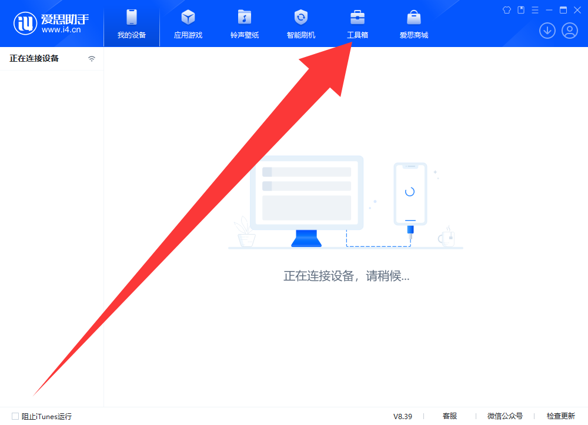
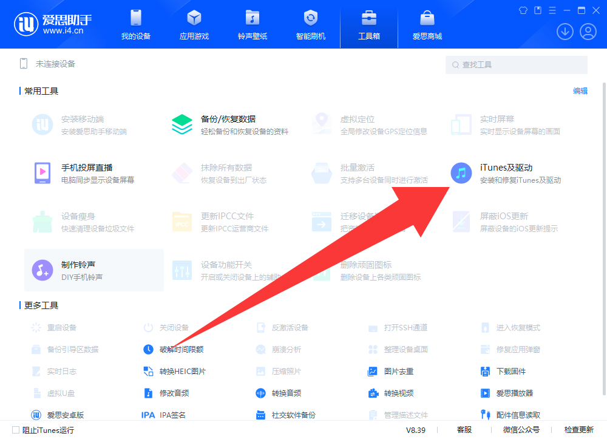
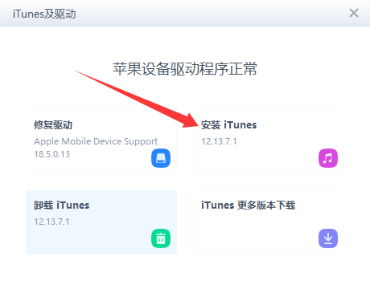
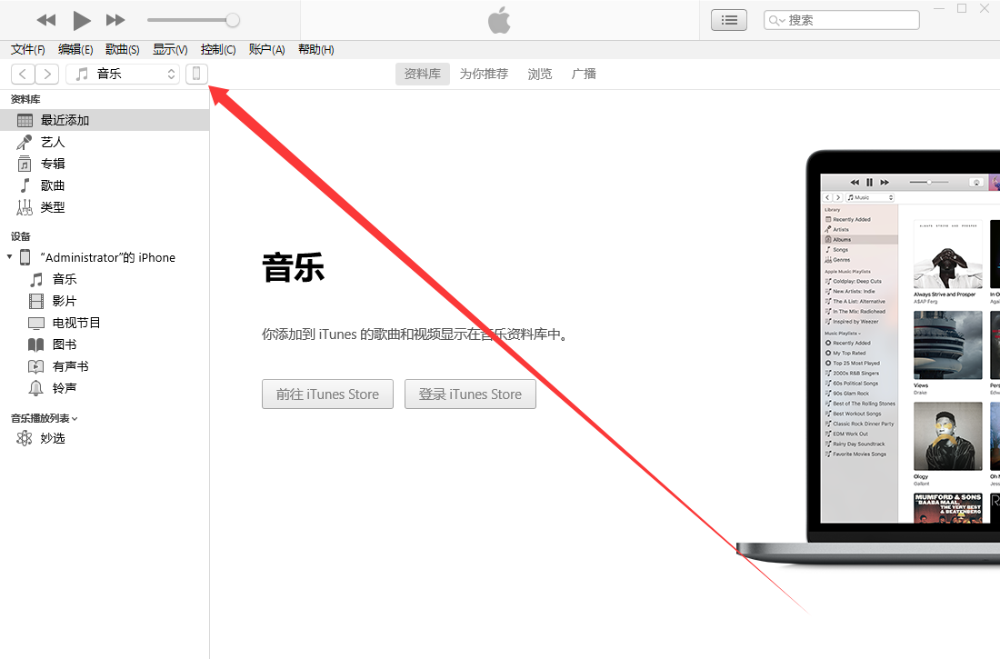
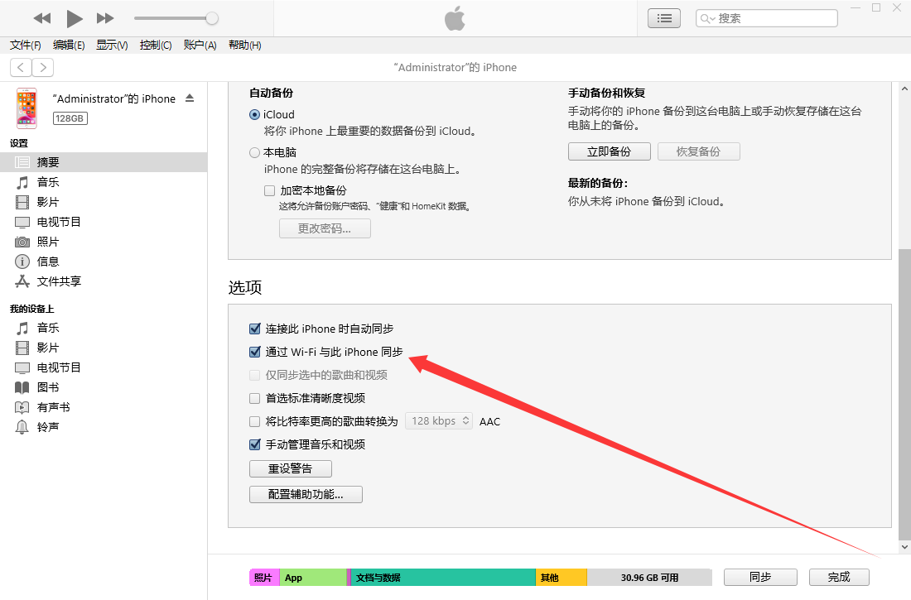
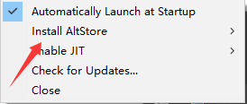
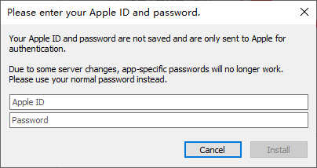

# 在 iOS 上安装 Amethyst

免越狱安装Amethyst

## 方法一：使用 AltStore

### （针对Windows用户）

1.点击此 [链接](i4.cn)下载爱思助手电脑端并安装

2.打开爱思助手，点击“工具箱->iTunes及驱动->安装iTunes”来安装iTunes

3.点击此 [链接](https://updates.cdn-apple.com/2020/windows/001-39935-20200911-1A70AA56-F448-11EA-8CC0-99D41950005E/iCloudSetup.exe)下载iCloud电脑端并安装

4.点击此 [链接](https://cdn.altstore.io/file/altstore/altinstaller.zip)下载AltServer

5.解压AltInstaller.zip并运行Setup.exe

6.将你的设备连接到电脑，并确保其已解锁。

7.打开iTunes，然后在设备上启用“通过Wi-Fi与此iPhone同步”

8.点击右下角任务栏中的 AltServer 图标。然后前往“Install AltStore”，并选择你的 iOS 设备。

9.输入您的 Apple ID 电子邮件地址和密码。

10.等待几秒钟，然后会出现一个 AltServer 通知，提示 AltStore 已成功安装到您的设备上。

11.在 iOS 设备上，前往“设置”->“通用”->“描述文件和设备管理”。点击“信任 您的 Apple ID”，然后再次点击“信任”进行确认。

（要在 iOS 16 或更高版本上使用 AltStore，您需要前往“设置”->“隐私和安全”->“开发者模式”在设备上启用开发者模式。）

12.从此 [链接](https://github.com/AngelAuraMC/Amethyst-iOS/actions) 下载 Amethyst 的 ipa 安装包。

#### （需要使用github账号才能继续下载）

### 手机开启JIT

13.打开“My Apps”选项卡，然后长按Amethyst。

14.按“Enable JIT”启动应用程序，几秒钟内您就会看到 AltStore 通知，提示 JIT 已启用。

### 电脑开启JIT

16.首先，确保Amethyst在设备前台运行。

17.点击右下角任务栏中的 AltServer 图标。然后点击“Enable JIT”>您的设备，然后选择Amethyst

后面即将补充

