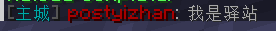
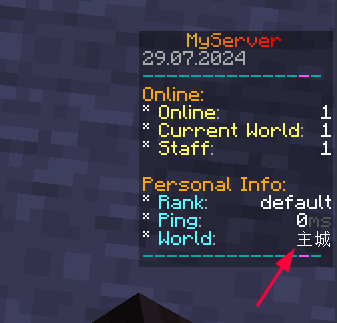

# Multiverse

:::info

`GitHub` https://github.com/Multiverse/Multiverse-Core

`SpigotMC` https://www.spigotmc.org/resources/.390/

`Bukkit` https://dev.bukkit.org/projects/multiverse-core

`modrinth` https://modrinth.com/plugin/multiverse-core

`插件百科` https://mineplugin.org/Multiverse-Core

:::

老牌多世界管理插件，可以新建，删除，导入世界（维度）等

值得一提的是，在 [GitHub releases](https://github.com/Multiverse/Multiverse-Core/releases) 上的版本比在 SpigotMC 上能下载到的版本要新

# 附属

## Multiverse-Core

[Multiverse-Core](https://github.com/Multiverse/Multiverse-Core/wiki) 是基础插件。下面的其它插件都必须需要 Core 。

本插件能够让你：

- 创建/修改/删除世界
- 传送到世界中
- 通过权限限制在世界间切换
- 查看某人在哪个世界中

## Multiverse-Portals

[Multiverse-Portals](https://github.com/Multiverse/Multiverse-Portals/wiki) 是类似于 Multiverse 1 类型的传送门。

如果你使用过它的话，你可能很想要本插件。

它们的大部分是一样的，只是有一些新特性。

本插件能够让你：

- 创建/修改/删除 Multiverse 类型的传送门
- 通过权限限制传送门的使用
- 可以步行或骑着载具在 Multiverse 世界间切换

## Multiverse-NetherPortals

[Multiverse-NetherPortals](https://github.com/Multiverse/Multiverse-NetherPortals/wiki) 起到了 Multiverse 1 插件中 splike 的作用，但改善了许多。

本插件是为了能够让你们有更加真实的体验而设计，允许玩家创建能够带他们去指定世界的地狱传送门。

所有在 X 世界的传送门都会去 Y 世界，但是这可以在游戏中配置。

本插件能够让你：

- 自定义某个世界中的地狱传送门指向哪个世界
- 自动连接有特殊命名模型的世界（如 WORLD 和 WORLD_nether）

取自 [插件百科 | Multiverse-Core#附属插件](https://mineplugin.org/Multiverse-Core#%E9%99%84%E5%B1%9E%E6%8F%92%E4%BB%B6)

# 崩服漏洞

> Fix issue where special chars cause PatternSyntaxException leading to a server crash.

Multiverse-Core [4.3.1](https://www.spigotmc.org/resources/multiverse-core.390/update?update=424085) 版本已经修复此问题，请更新到最新版

如果你因为某些原因不能更新到最新版，可以使用修复补丁

补丁（只需安装其中一个）：

- [Multiverse-Patches](https://www.spigotmc.org/resources/.96390)
- [Multiverse-Core Fix](https://www.spigotmc.org/resources/.70218)

# 案例

## 中文世界名





所需插件：

- Multiverse-Core
- [PlaceHolderAPI](../Front-Plugin/PlaceHolderAPI/outline.md)
- [聊天插件](../ManageTool/chat/chat.md)
- [TAB和计分板插件](../other/TAB&Scoreboard/Tab&Scoreboard.md)
- 其他你想展示中文世界名的插件

**安装papi的 Multiverse 扩展**

[点击此处](../Front-Plugin/PlaceHolderAPI/CommonUsage.md#multiverse-core)

**设置别名**

编辑 `plugins/Multiverse-Core/worlds.yml`

下方展示部分配置
```yaml
worlds:
  world:
    ==: MVWorld
    hidden: 'false'
    alias: ''
    # 省略部分内容
  world_nether:
    ==: MVWorld
    hidden: 'false'
    alias: ''
    # 省略部分内容
  world_the_end:
    ==: MVWorld
    hidden: 'false'
    alias: ''
    # 省略部分内容
```

解释：
- worlds        - 插件检索的YAML节点，不用管
- world         - 主世界的默认本名（可在server.properties修改）
- world_nether  - 地狱的默认本名
- world_the_end - 末地的默认本名
- alias         - 这个世界的别名

我们在 **alias: ''** 中 `''` 填入这个世界的别名

如：
```yaml
worlds:
  world:
    ==: MVWorld
    hidden: 'false'
    alias: '主城'
    # 省略部分内容
```

然后 `/mv reload`

**使用别名**

将变量 `%multiverse_world_alias%` 写到你想展示世界别名的插件配置里

当然，这个插件要支持使用papi变量

接着 **重载那个插件**
