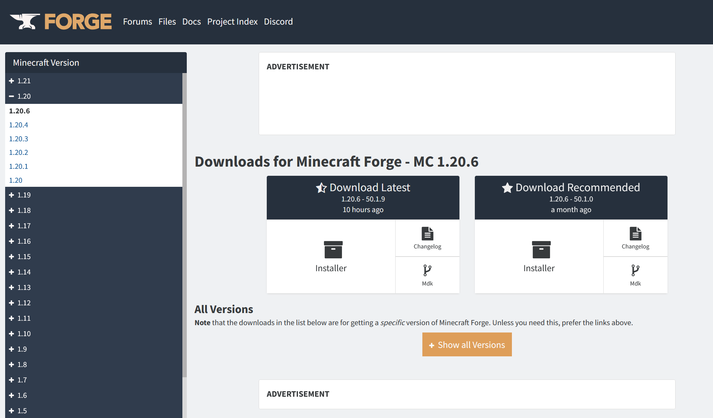
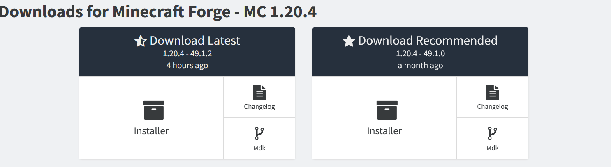
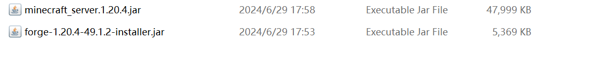

# 安装服务端

:::tip

该教程是为 mod 服所编写的，插件和混合直接新建文件夹扔进去就完事

:::

全篇以 1.20.4 Mod 服务端安装为例子

如果你看不懂可以使用[笨蛋脚本](https://github.com/lilingfengdev/NitWiki-Script/releases/download/windows-latest/select-server.exe)，目前不支持 Fabric

## Forge

首先，来到 [Forge 官方网站](https://files.minecraftforge.net/net/minecraftforge/forge/)



在左边的 `Minecraft Version` 找到你需要的版本，然后下载下来



请选择 `Installer` ，左边右边都无所谓，打开后，你会来到一个广告窗口，点击最上面的 `SKIP`(没有出现就等一会)


然后你就成功下载了 Forge Installer，但还没有完!，继续

在浏览器中输入以下链接

```
https://bmclapi2.bangbang93.com/version/这里填你的MC版本/server
```

比如我 1.20.4 服务器应该是 `https://bmclapi2.bangbang93.com/version/1.20.4/server`

下载下来后，你需要将文件重命名为`minecraft_server.这里填你的MC版本.jar`，比如我1.20.4服务器应该是`minecraft_server.1.20.4.jar`，现在你的目录应该长这样



接着打开cmd，不会请查看[开启 cmd](launch-server.md#笨蛋脚本)，输入以下命令

````shell
java -jar forge-1.20.4-49.1.2-installer.jar(这里请改成你下载的文件名) --installServer
````

然后静待一会，直到控制台输出 `The server installed successfully` 就完成了!

## NeoForge

与Forge差不多，官网换[这个](https://neoforged.net/)

## Fabric

Fabric 服务端安装器[点这](https://fabricmc.net/use/server/)

下载方法如图（下载完毕后请不要运行！）


下面对此文件称呼为 Fabric 服务端安装器。

下载好后双击运行。
:::tip

如果出现第一次双击后只有 .fabric 、 libraries 两个文件夹的情况。
再次双击运行该文件夹内的 Fabric 服务端安装器。请不要过于着急而反复双击，也不需要删除已创建的文件夹，只需耐心等待一会。如果超过5分钟仍然没有变化，则尝试再次双击该文件夹内的 Fabric 服务端安装器。

:::
等待出现一些文件和文件夹后，修改eula文件为true，然后使用命令运行 或 直接双击运行 该安装器（同时是服务端核心）
