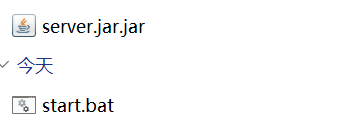

# 常见问题


## Downloading mojang_x.x.x.jar

如果你的服务器卡在：

```text
Downloading mojang_x.x.x.jar
```

请尝试使用科学上网。

import GlobalContent from '@site/src/components/GlobalContent'

<GlobalContent>

## 我不会在命令行界面 (CMD / 终端 / Powershell) 使用科学上网

:::tip

其实你可以直接开启 TUN 模式

记得让小地球变绿


:::

请确定你的科学上网是可用的，不多赘述。

在命令行界面 (一般情况下，一个黑 / 蓝框框) 中执行这两条

```batch
set http_proxy=http://127.0.0.1:7890
set https_proxy=http://127.0.0.1:7890
```

如果在 Linux 下则是这样的：

```bash
export HTTP_PROXY=http://127.0.0.1:7890
export HTTPS_PROXY=http://127.0.0.1:7890
```

其中 `7980` 是你的科学上网软件设置的端口，若有不同，请替换。

注：输入之后仅对这个命令行窗口有效，`开启新的 / 关闭它` 之后要重新输入。

> 大佬们，浏览器能用不是 cmd 能用，不然你猜我为什么写这个。

</GlobalContent>

## 中文乱码

如果你用的是 Windows，你需要在启动脚本**最前面**加上`chcp 65001`

如上面的方法无效，检查你的系统区域设置是否为中国和中文语言包是否下载。

比如你原来的启动脚本长这样

```shell
java -Xms2G -Xmx2G -jar server.jar --nogui
```

你需要改成这样

```shell
chcp 65001
java -Xms2G -Xmx2G -jar server.jar --nogui
```

## Java 启动找不到 ***.jar

有些时候写好启动脚本启动后，报错`Error: Unable to access jarfile xxx.jar`，但是相同目录下明明有`xxx.jar`

像这样：


启动后报错，此时我们可以查看文件后缀名 ([不懂如何打开请点这里](https://cn.bing.com/search?q=%E5%A6%82%E4%BD%95%E6%9F%A5%E7%9C%8B%E6%96%87%E4%BB%B6%E5%90%8E%E7%BC%80%E5%90%8D))

然后你就会看到这样的惊奇一幕



此时，你只需要把 `xxx.jar.jar` 改成 `xxx.jar` 就可以正常启动了

## Invalid initial heap size: -Xms

:::note

内存大小设置长这样

```shell
-Xms1024M -Xmx2048M
```

不是这样！

```shell
-Xms 1024M -Xmx 2048M
```
:::

## 新版 Forge / NeoForge 启动

使用安装器安装后，你无法在根目录找到 `xxx.jar`，同时会生成一个 bat 脚本。里面大概是这样的

```shell
@echo off
REM Forge requires a configured set of both JVM and program arguments.
REM Add custom JVM arguments to the user_jvm_args.txt
REM Add custom program arguments {such as nogui} to this file in the next line before the %* or
REM  pass them to this script directly
java @user_jvm_args.txt @libraries/net/minecraftforge/forge/1.18.2-40.1.60/win_args.txt %*
pause
```

这是因为新版的 Forge 和 NeoForge 将服务器 jar 包放在 libraries 文件夹里面，并通过自带的启动脚本进行启动。
前面 `REM` 开头的是注释，大概就是说

> Forge 需要一组配置好的 JVM 和程序参数。
> 向 user_JVM_args.txt 添加自定义 JVM 参数
> 在%*或之前的下一行将自定义程序参数（如 nogui）添加到此文件中
> 直接将它们传递给此脚本

此时你会发现有一个 `user_JVM_args.txt` 在你的根目录下，打开他，将原来的

```shell
java -Xms2G -Xmx2G -jar server.jar --nogui
```
中 `java` 和 `-jar` 之间的内容填写到该文件中。

如果你想使用 `nogui`，就像注释里面说的，在 `@libraries/net/minecraftforge/forge/1.18.2-40.1.60/win_args.txt` 和 `%*` 之间写入 `nogui`

就像这样

```shell
java @user_jvm_args.txt @libraries/net/minecraftforge/forge/1.18.2-40.1.60/win_args.txt nogui %*
```
