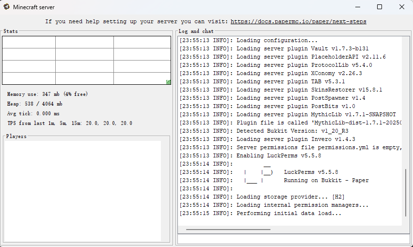

# java 命令

此页面将介绍 java 命令关于优化之外的参数。

如果你想寻找优化参数，点击 [这里](/docs-java/process/maintenance/optimize/jvm/jvm.md)。

## -Xms -Xmx - 设置内存

- `Xms` - 最小内存
- `Xmx` - 最大内存

```shell title="示例"
java -Xms2048 -Xmx4096 -jar server.jar
```

```shell title="你也可以这样配置"
java -Xms2048M -Xmx4096M -jar server.jar
java -Xms2G -Xmx4G -jar server.jar
```

## --nogui - 关闭 GUI

```shell
java -jar --nogui
```

关闭这个没有用处的 GUI。



## LibraryLoader - 下载源加速

默认的 SpigotLibraryLoader 下载源或插件使用 PaperLibraryLoader 添加的 Maven 中心仓库下载源在国内访问很慢，

如果你使用的是 Leaf，你可以添加参数使用国内下载源：

```shell
-DLeaf.library-download-repo=https://maven.aliyun.com/repository/public
```

如果你使用的是 Paper 1.21.6(及其分支) 之后的版本 ，可以使用以下系统属性配置 Maven 中心仓库镜像：

```shell
-Dorg.bukkit.plugin.java.LibraryLoader.centralURL=https://maven.aliyun.com/repository/central
```

或者设置环境变量（优先级更高）：

<Tabs queryString="system">
  <TabItem value="windows" label="Windows">

    ```shell
    # Windows (PowerShell)
    $env:PAPER_DEFAULT_CENTRAL_REPOSITORY="https://maven.aliyun.com/repository/central"

    # Windows (CMD)
    set PAPER_DEFAULT_CENTRAL_REPOSITORY=https://maven.aliyun.com/repository/central
    ```

  </TabItem>

<TabItem value="linux" label="Linux/MacOS">

    ```shell
    # Linux/MacOS
    export PAPER_DEFAULT_CENTRAL_REPOSITORY=https://maven.aliyun.com/repository/central
    ```

  </TabItem>
</Tabs>

如果不是上述核心，你可以使用 [Spigot Library Booster](/docs-java/process/plugin/more/tittle-tattle.md#spigot-library-booster)

### 其他国内镜像源

- **阿里云 Maven 中心仓库**: `https://maven.aliyun.com/repository/central`
- **阿里云公共仓库**: `https://maven.aliyun.com/repository/public`
- **华为云 Maven 中心仓库**: `https://repo.huaweicloud.com/repository/maven/`
- **腾讯云 Maven 中心仓库**: `https://mirrors.cloud.tencent.com/nexus/repository/maven-public/`

:::tip 性能提示

使用国内镜像源可以显著提升插件依赖库的下载速度，特别是在服务器首次启动或安装新插件时。

:::

## UTF-8 - 中文编码

防止乱码

```shell
-Dfile.encoding=UTF-8
```

如果仍然乱码,可以在启动命令之前添加:

```shell
chcp 65001 # for Windows
java -jar server.jar
```
