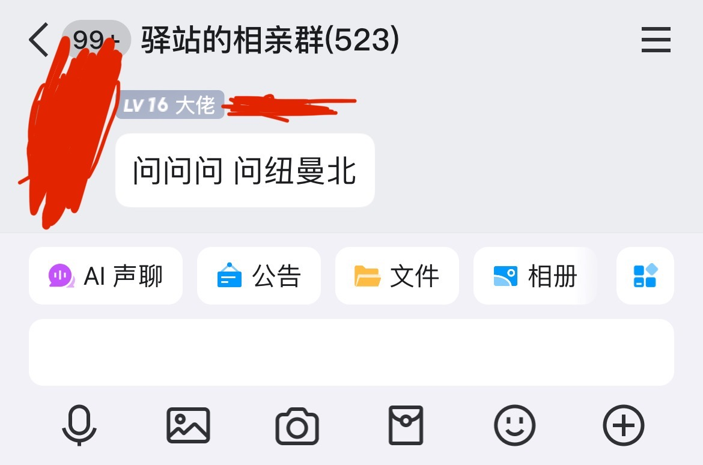

## 前情提要

**这篇文章主要作用是晓之以理，而不是教学。**

丑话说在前面，这文档别名为"反赛博雅利安人文档"。

作为一个高手，你拥有足够的实力。你无论回答与否，都是你自己的权利，你可以选择不回答。但是你的实力不是你在群里靠刷屏淹没求助或者辱骂的特权。

写这个文档的原因，是因为有些人**压根**没有去跟提问者正常沟通，但得出了"那个提问者是xx"的结论。虽然帮助者没有义务帮忙，但**提问者也没有义务当一个受气包**。

在接手的帮助案例中，我发现，大部分人虽然没有基础的电子产品使用经验，但非常乐于学习，很多都是能学会的。

还有，我们似乎**很愿意去默认**所有人**都**安装了诸如 VSCode, 基于Chromium的浏览器, 甚至是默认所有人都用那种比较全能的 Bandizip 。但这正是**判断问题的大失误**。

另外，我们都是从小白那种摸石头过河的时期过来的。这个文档就像石头，是让新手摸着过河的，**不是用来砸向从前的自己的**。

顺带一提：无论你是提问的还是帮忙的，都需要一个强大的心理素质。

### 帮助者经常遇到的问题

- 对方态度恶劣。
- 除了"求救"什么也不发。
- 明明要解决a问题，对面提问的却是b问题，并自以为b问题的答案适用于a问题。
- 不正确提供所需的信息。
- 以"机密"为由拒绝帮助但是又求别人帮他然后梅开二度。
- 要解决的是完成了义务教育的人类多看两眼报错就能解决的问题。

诸如此类。

### 提问者经常遇到的问题：

- 对方答非所问。
- 由于不知道哪一步做错了直接挨骂。
- 要求你百度/看文档。
- 被问到一些明明和解决问题毫无关系的事情。
- 在某些群里提问被踢出群聊。
- 因为对方提供的错误方法，导致造成了损失。
- 一提问就有人刷屏。
- 不知道如何提问。

诸如此类。

### 我是不是在洗那些被称为白痴的人？

你愿意这么理解的话，我就是这样。

顺带一提：我见过很多最后谈崩的案例不是小白单方面的不对，而是沟通上出现了很大的问题。双方只要有一方不愿意正常沟通，就很容易急眼到互挂。

## 如何正确帮助小白解决问题

你既然终于下定决心去帮助他人了，那么你就要收起你那个傲慢的脾气，不然会非常影响接下来的沟通。我很相信，如果能好好说话，大部分人还是愿意配合的。

### 常见小白提问情景与应对方法

#### 只发了"求救"

告诉他我们不是算命的，并引导他提供必要的信息。

#### 提的问题文档有

发文档对应位置链接，不要光挂个主页面就潇洒走人，没达到帮助目的还浪费对面时间。

#### 缺少日志

引导他通过 [Mclogs](https://mclo.gs/) 发送日志，比如将 如何使用Mclogs 的文档发他让他看。

#### 缺少模组列表/插件列表

让他截图plugins文件夹和mods文件夹，或者在服务端运行对应命令。

#### 态度恶劣

没得办，下一个。

#### 一眼定错误类

让他多看几眼控制台或者游戏聊天框。

#### 机密推脱类

拒绝服务。

#### ab问题类

引导他正确提问出a问题，并解决。

### 面对你无法回答的复杂问题

虽然大部分小白都不太可能折腾出这类问题，但还是要说。

首先，因为自己能力不足，无法回答问题，完全可以跟他说我不明白，然后推一个你认识的人或者让他另外找人，这件事不丢脸。真的。

在无论是笨蛋文档还是其他文档基本都提过，任何人都不可能100%回答出别人的问题，也不可能100%了解别人用的插件或模组。

所以，你放弃回答，不是一个懦弱的表现，为了面子而不懂装懂的回答才是。

至于你回答错了，也怪不到你，别人不一定解决的了的问题你弄错了也很正常。

### 错误示范

