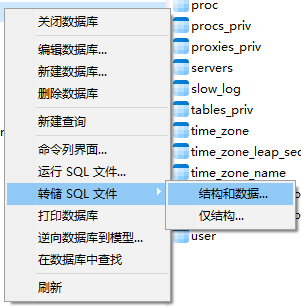
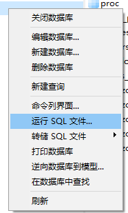

## 手动备份

### 使用命令行备份

使用命令行备份数据库的步骤如下：

1. 打开命令行终端。

2. 使用以下命令格式进行备份：

   ```shell
   mysqldump -u [用户名] -p [数据库名] > [备份文件名].sql
   ```

   例如：

   ```shell
   mysqldump -u root -p mydb > mydb_backup.sql
   ```

3. 输入密码后，系统会开始备份过程。

4. 备份完成后，你会在当前目录下看到生成的 .sql 文件。

注意事项：

- 确保已安装 MySQL 客户端工具。
- 如果数据库很大，备份过程可能需要一些时间。
- 建议定期进行备份，并将备份文件存储在安全的位置。

要还原备份，可以使用以下命令：

```shell
mysql -u [用户名] -p [数据库名] < [备份文件名].sql
```

例如：

```shell
mysql -u root -p mydb < mydb_backup.sql
```

### 使用 Navicat 备份

展开你想要备份的数据库，点击备份，再点击新建备份


然后点击备份即可开始备份


中间的命令行提示这一条的时候备份即已完成


**那我可以指定把数据库备份放在那里吗？**

当然可以！

右键你的连接，点击编辑连接


点击数据库，修改这里的设置位置即可让 Navicat 将你的数据库备份到你想要到的地方了


**如何使用备份？**

右键你想要使用的备份，然后点击还原备份


然后在弹出的界面中点击还原，当命令行出现这句话的时候，数据库就还原成功了


**对于数据量非常大的数据库，备份起来很慢，还容易出错，怎么办？**

遇到这种情况，不用慌张，我们这个时候转储 SQL 文件即可

转储 SQL 文件，能够极大降低还原备份时出错、数据缺失的问题

我们右键想要转储为 SQL 文件的数据库，点击转储 SQL 文件，点击结构和数据



之后我们选择一下 SQL 文件的转出位置

当命令行出现这句话的时候，即已完成转储

之后当我们需要使用备份的时候，我们再次右键那个数据库，点击运行 SQL 文件



然后找到你之前转储的后缀为 `.sql` 的文件，选中并确定后点击开始。当命令行出现这句话的时候，数据库就还原成功了


### 使用 HeidiSQL 备份

TODO

### 使用小皮工具箱备份

TODO

### 使用宝塔面板备份

TODO

### 使用 1Panel 面板备份


#### 进阶教程：新增备份账号

>  什么是备份账号？简单来讲，备份账号是 1Panel 面板中不同的存储位置，即 **将备份存储在哪里**

TODO

## 自动备份

### 使用 Navicat 自动备份


点击自动运行，然后点击新建批处理作业


之后分别点击：备份 - 需要备份的数据库名字 - backup 数据库名

即可添加备份任务


完成这些步骤后点击保存，设置完任务名称后点击设置计划任务


点击触发器，新建触发器，然后自行设置备份任务时间

最后保存计划任务就大功告成啦

### 使用 1Panel 面板自动备份


