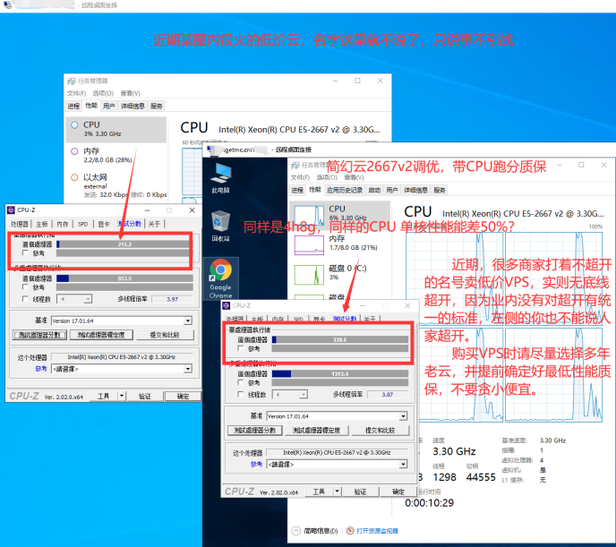

# 购置服务器

:::danger

低价云超开导致性能下降，不要贪图便宜!!!

:::

搭建 Minecraft 服务器对服务器的 CPU 性能、内存大小、硬盘 I/O 速度和网络质量，网络带宽均有较高的要求。

## CPU

### 核心数

总的说来，核心数量要根据玩家数量，服务器性质，预算选择。

由于 Minecraft 的 [Tick-loop](/docs/start/基础知识/如何评判服务器卡顿.md) 逻辑是单线程的。更多核心只能用于生成区块、插件任务等非主线程任务，不建议超过 8 核心的服务器继续增加核心提升流畅度。

普通插件生存服，人数少于 50 时一般可以使用单端处理，选择核心数量 4 - 8 个。

人数 > 50 推荐使用多端均衡或者 Folia ，常见的分生存 x 区的就是多端。这两种方式都可以有效利用多核心。

对于多端，核心数量主要取决于总人数，每 100 玩家多加 4 - 8 个核心是较为合理的。

而Folia 官方推荐的配置在 16 核心以上，如果是新手或对现有插件有严重依赖的不推荐使用，生态较差。

### CPU单核性能

一般的，当你搭建是纯净的、不含模组的服务器时，对单核性能的要求较低；当你搭建是含模组的服务器时，对单核性能的要求较高。

CPU 总占用不算高时，Minecraft 的服务器性能与 CPU 单核性能几乎为线性关系，单核性能翻倍几乎就可以多带一倍**甚至更多**的人。

尽量选择不超开的云（如上图，图中 50% 的性能差就在于低价云超开导致性能下降，不要贪图便宜，服务器到手后要自己跑分）

不超过 20 人时为节省成本可以使用 E5 主机，而单端人数多于 20 基本就意味着需要牺牲玩家的游戏体验或者需要换更好的 CPU 。

## 内存

:::info

内存几乎不用考虑 DDR4 / DDR5，高频/低频内存的区别，最重要的是内存大小。使用高频 DDR5 内存和 DDR 4 内存开服基本没有差别，如果是自己买的服务器托管的就省点钱吧。

:::

一般来说， mod 服比插件服占用高、高版本比低版本略高。尽量选择核心数与内存比例在 1:2 以上的套餐（推荐 1:2 - 1:4 ）

一方面，多核少内存必然面临性能下降。另一方面，核心多内存少基本为超开，性能会比正常情况下差很多。

大厅服分配 1G - 2G 内存，普通生存服务器或空岛服务器建议分配 8G - 12G ，单端人数较多建议使用 12G - 24G 内存。

:::warning

并不是人越多需要的内存越多，不建议分配过多内存，否则导致 GC (内存垃圾回收)时间过长导致顿卡。

:::

## 带宽

根据玩家数量及视野情况分配。一般情况低版本全默认情况下平均每个玩家会使用 0.25 - 0.4 Mbps 的上行带宽；

1.18以上服务器平均每人使用0.3-0.5Mbps上行带宽（一群跑图佬另说）也就是说一般提供的10M带宽够带15-20人。

同样的有的服务商会提供所谓“共享上行”，有时会出现其他用户传文件，VPS所在宿主机所有用户都变卡的情况，建议无论如何搞到一个独享带宽保底。

需要注意的是，想要家庭带宽开服要考虑到吃DDOS和部分运营商不提供公网或者公网上行速度非常慢的情况，只建议基友服使用，或者配合FRP等流量转发方式使用。

## 系统

如果希望长期开服，强烈推荐使用linux系统（如Ubuntu/CentOS等）
